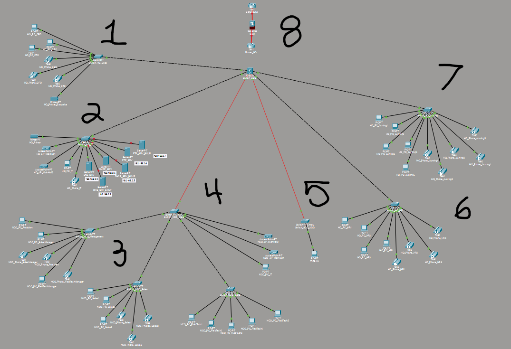
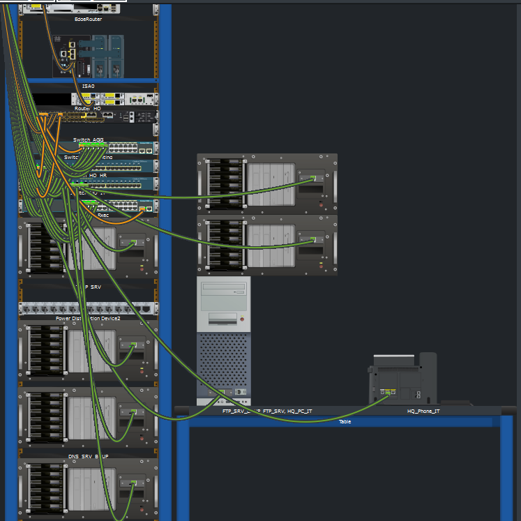
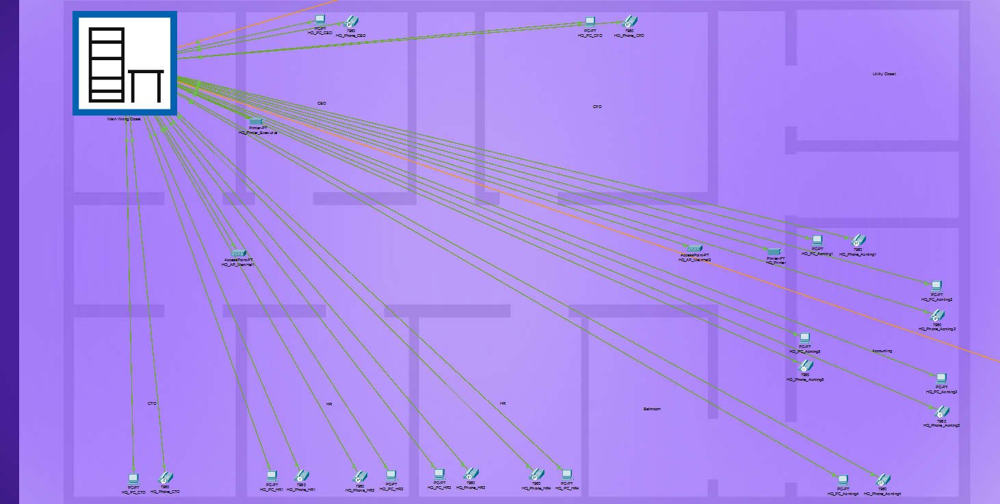
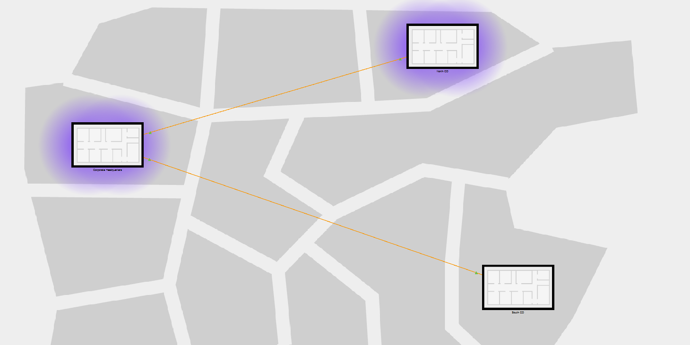
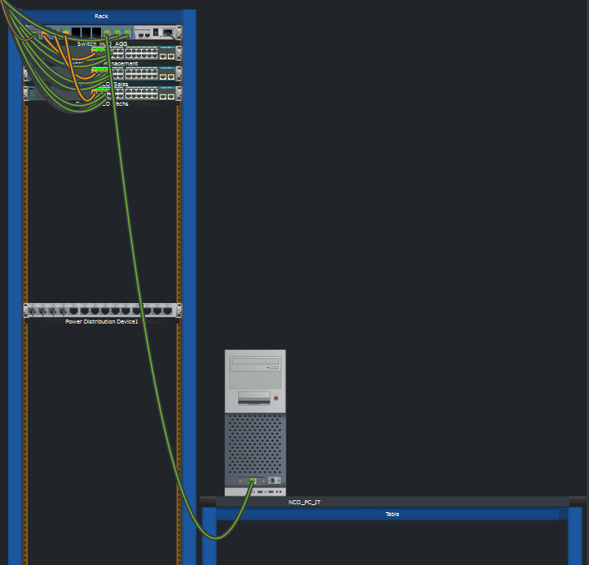
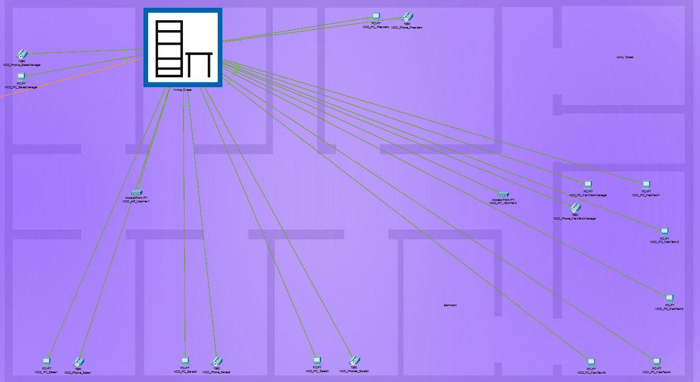
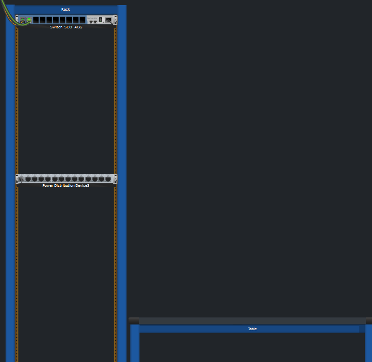
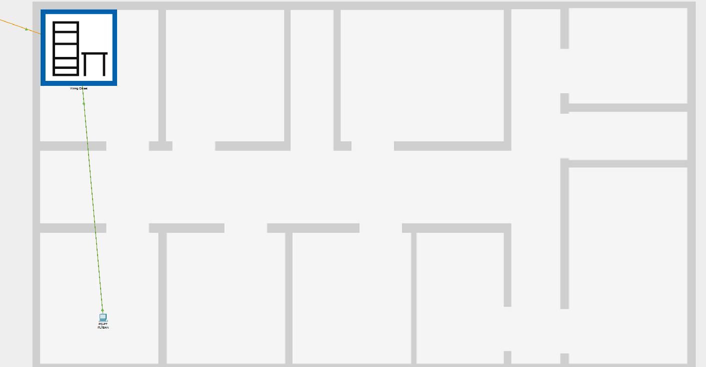

# **Medium Sized Network Project**

**Author:** Vincent Pierce

**Project Start Date:** 7/16/2026

**Latest Revision:** 8/4/2026

**Topology Contents**  
[*Segment 1*](Section1.md)  
[*Segment 2*](Section2.md)  
[*Segment 3*](Section3.md)  
[*Segment 4*](Section4.md)  
[*Segment 5*](Section5.md)  
[*Segment 6*](Section6.md)  
[*Segment 7*](Section7.md)  
[*Segment 8*](Section8.md)  

## **Objective**

This project was utilized to strengthen my understanding of configuring switches, implementing protocols, designing a larger network that spans several geographical locations, and troubleshoot various networking issues along the way.

I utilized a collapsed core, extended star topology due to its straight forward simplicity as well as its ease of scalability. In a simulated project environment like packet tracer, there are obviously no real world considerations such as cost, physical space, etc, so these did not play any factor in my decisions.

## **Details**

All switches are secured with a password. For the purposes of this project, the password used is "secretpassword". The Layer 3 switch password is "Secretpassword1".

### Network Topology

*Zoomed images are provided in each section's Docs. Sections are labeled as above.*

### VLANs \& Subnets

The entire project utilizes inter-vlan routing through the L3 switch (S\_AGG) and the subnets are simply just translations from the vlans in order to enact the routing.

* IT Devices (Printers, APs, etc) - VLAN 100, Default-Gateway: 192.168.1.1/24
* Servers - VLAN 150, Default-Gateway: 192.168.2.1/24
* PCs - VLAN 200, Default-Gateway: 192.168.3.1/24
* Phones - VLAN 300, Default-Gateway: 192.168.4.1/24

### Device Quantities

* Cisco 2960-24TT (L2 Switches) - 7
* Cisco PT Switch (L2 Switches) - 2
* Cisco IE-9320 (L3 Switch) - 1
* PCs - 26
* Cisco 7960 (IP Phones) - 19
* Printers - 2
* APs - 4
* Servers - 6

## **Design Decisions**

Brief overview of all the design decisions made throughout the planning and implementation of the project. All specific reasonings and decisions may be found in the independent documentation pages.

### Switch Hierarchy

The network does not have anything fancy such as multiple floors in buildings, separate corporations working under one organization but they all need separate networking, and things like that. So, the switches are simply grouped based upon the various departments. Any departments in a different CO (Central Office) are considered as separate, but still exist inside the same VLAN. This is so I could simply run one fiber line to each CO aggregation switch and not have several lines (you could argue this could be a cost consideration).

### Server Organization

Each of my servers has a backup in place. These backups are being utilized as a conscious placeholder to provide an example of my understanding of including backups for critical infrastructure. There were several issues involved with getting the backups actually working, and packet tracer does not necessarily need backups. So, there are backups, but they are just there is all.

**Addresses**

* DNS Server - 192.168.2.2
* DNS Backup Server - 192.168.2.3
* DHCP Server - 192.168.2.4
* DHCP Backup Server - 192.168.2.5
* FTP / SMTP Server - 192.168.2.6
* FTP / SMTP Backup Server - 192.168.2.7

*Additional details are covered in* [*Section 2's*](Section2.md) *documentation.*

### VoIP Issue \& ROAS

As it currently stands, routing on a stick is not implemented. As stated, from the start the plan was to focus on the simple network setup, solidify switch configs, and get protocols working. At the very start of the project there was yet a realization that the layer 3 switch lacked a telephony service. So, when all the phones received their network IP and were stuck on configuring their Call Manager Lists, I realized the issue. I tried setting up the ROAS just for VoIP but deemed it was out of the scope of this project. I have another lab where I focused on setting up VoIP, sending, and receiving calls. At the end of the day, the phones are setup to work, but they basically do not have an extension number or know any other phone extension.

### Lines

Attaching a brief note to emphasize that Packet Tracer has Auto-MDIX, but I took a conscious approach to making sure straight through, crossover, and fiber cables are properly utilized. The two fiber lines connecting to the CO's are multimode, and I would of liked for them to be single mode. However, packet tracer was having issues with VLANS when they were single mode.

## **Device Layouts**

### HQ Server Room
*ignore the two servers stacked on top of the pc*

### HQ Device Map

### Geographical Area Map

### North CO IDF Closet

### Nort CO Device Map

### South CO IDF Closet

### South CO Device Map

## **Closing**

As of now, the project is considered complete. If I decide to revisit this in the future, the documentation will be updated accordingly. All subsequent sections cover more detail as to what each isolated switch, port, and end device is doing in relation to the entire network. Provided is a quick link to all the other section docs.

All of the proof of concepts have attempted to mesh with the entire network to demonstrate all features successfully working with each other properly.

**Topology Contents**
[*Segment 1*](Section1.md)  
[*Segment 2*](Section2.md)  
[*Segment 3*](Section3.md)  
[*Segment 4*](Section4.md)  
[*Segment 5*](Section5.md)  
[*Segment 6*](Section6.md)  
[*Segment 7*](Section7.md)  
[*Segment 8*](Section8.md)  
\*  
\*  
\*  