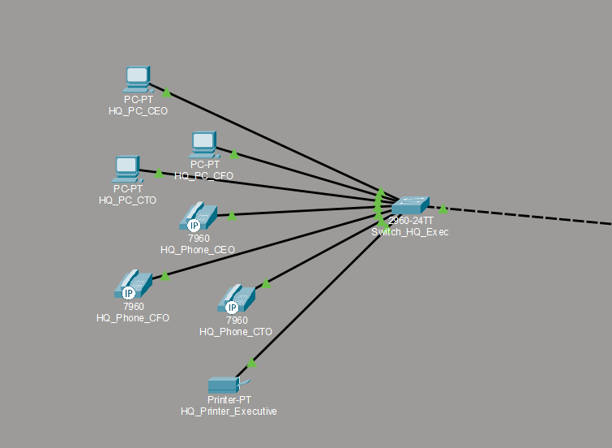
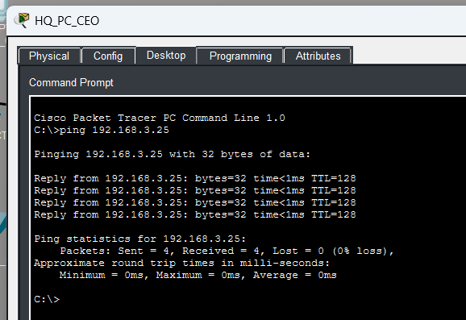
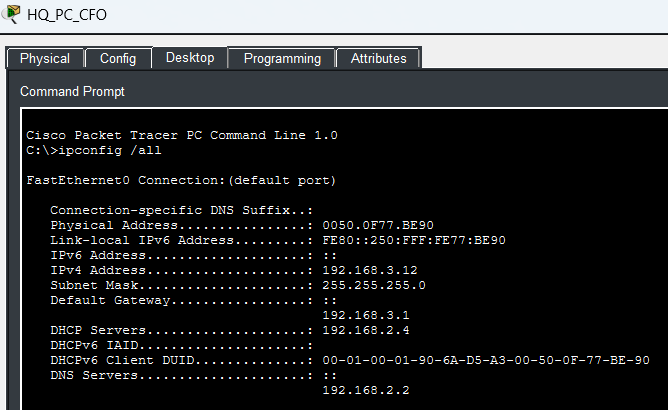
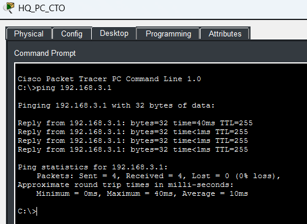

# **Segment 1**

**Author:** Vincent Pierce  
**Project Start Date:** 7/16/2026  
**Latest Revision:** 8/4/2026  

[**Back To Overview**](Overview.md)

This segment represents the switch dedicated to the Executive Team and is located at the main office headquarters.

## **Devices**

Switches - 1  
PCs - 3  
Phones - 3  
Printers - 1  

### Device Details

IPV4 address will differ from documentation due to DHCP. Not documenting the current state of the address as of the revision date.

**HQ\_PC\_CEO (PC1):**

* MAC Address: 00E0.8FE5.9D99
* Switch Port: Fast Ethernet 0

**HQ\_PC\_CFO (PC2):**

* MAC Address: 0050.0F77.BE90
* Switch Port: Fast Ethernet 0

**HQ\_PC\_CTO (PC3):**

* MAC Address: 0060.5CC4.935A
* Switch Port: Fast Ethernet 0

**HQ\_Phone\_CEO (Phone1):**

* MAC Address: 00E0.A358.12BC
* Switch Port: Fast Ethernet

**HQ\_Phone\_CFO (Phone2):**

* MAC Address: 0010.11D4.AC27
* Switch Port: Fast Ethernet

**HQ\_Phone\_CTO (Phone3):**

* MAC Address: 00D0.5886.C518
* Switch Port: Fast Ethernet

**HQ\_Printer\_Executive (Printer):**

* MAC Address: 0030.F22A.7340
* Switch Port: 0

### Switch Details

All of the access switch ports have spanning-tree port fast enabled as well as the bpdu guard. They are verified to be always connected to an endpoint and not looping.

**Gigabit Ethernet Port 0/1:**

* Switchport Mode: Trunk
* Allowed Trunks: 100, 200, 300
* Native Vlan: 99

**Fast Ethernet Port 0/1:**

* Switchport Mode: Access
* Assigned Vlan: 200
* Connected Device: PC1

**Fast Ethernet Port 0/2:**

* Switchport Mode: Access
* Assigned Vlan: 200
* Connected Device: PC2

**Fast Ethernet Port 0/3:**

* Switchport Mode: Access
* Assigned Vlan: 200
* Connected Device: PC3

**Fast Ethernet Port 0/4:**

* Switchport Mode: Access
* Assigned Vlan: 300
* Connected Device: Phone1

**Fast Ethernet Port 0/5:**

* Switchport Mode: Access
* Assigned Vlan: 300
* Connected Device: Phone2

**Fast Ethernet Port 0/6:**

* Switchport Mode: Access
* Assigned Vlan: 300
* Connected Device: Phone2

**Fast Ethernet Port 0/7:**

* Switchport Mode: Access
* Assigned Vlan: 100
* Connected Device: Printer

## **Proof of Concepts**

*PC1 can successfully reach the IT PC on segment 2.*  

*All the ipconfig details are valid and accurately represent PC2 on this segment.*  
  

*The default gateway on PC3 is reachable. So, all the other devices on this switch are able to reach the gateway as well.*  

[Return to Top](#top)  
[Back To Overview](Overview.md)

\*  
\*  
\*  

