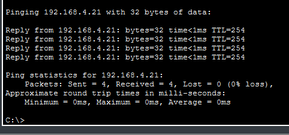
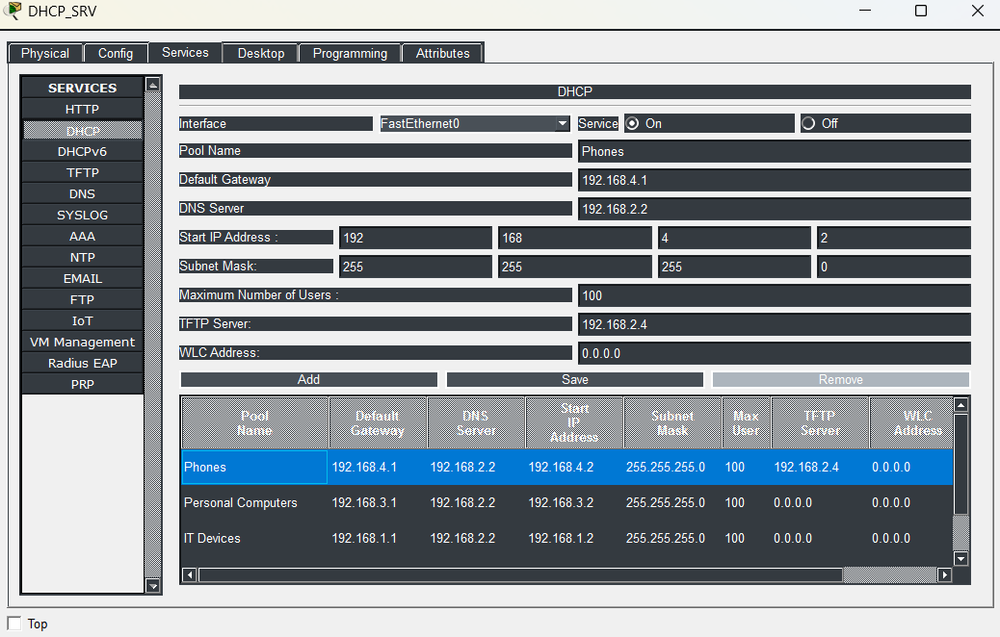
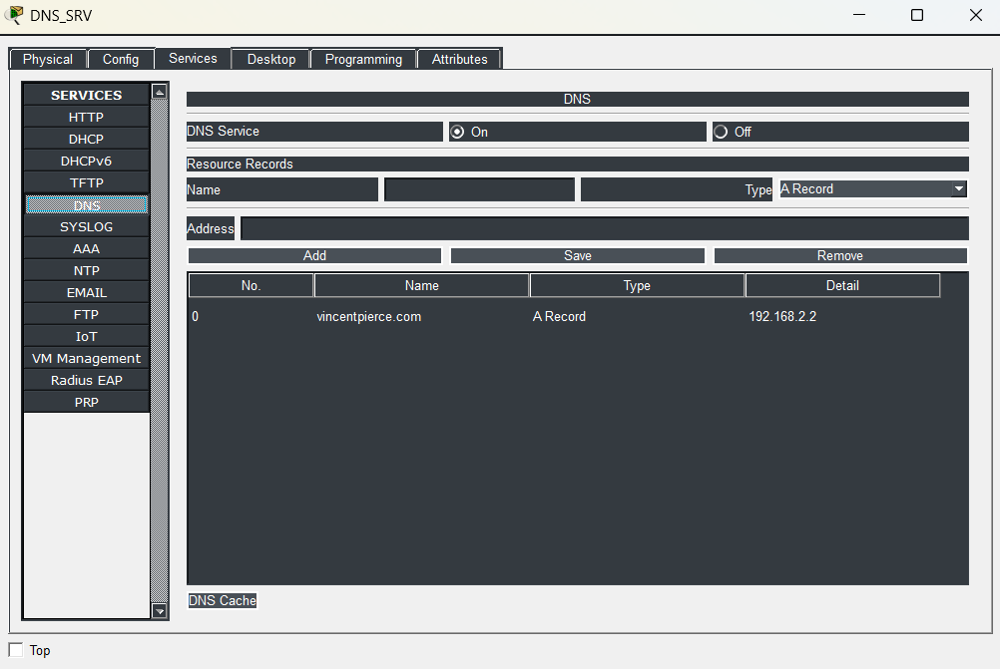
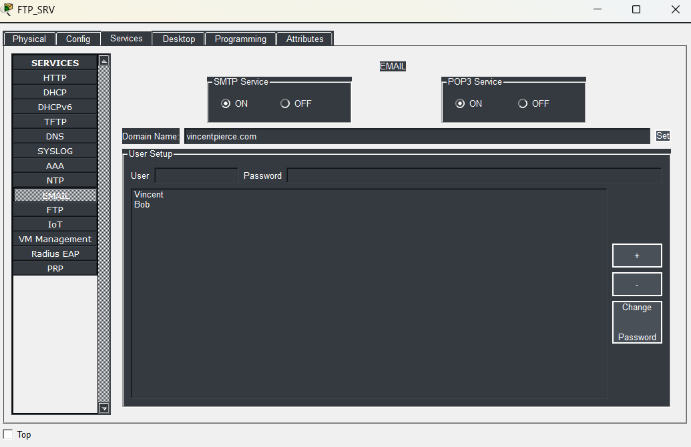
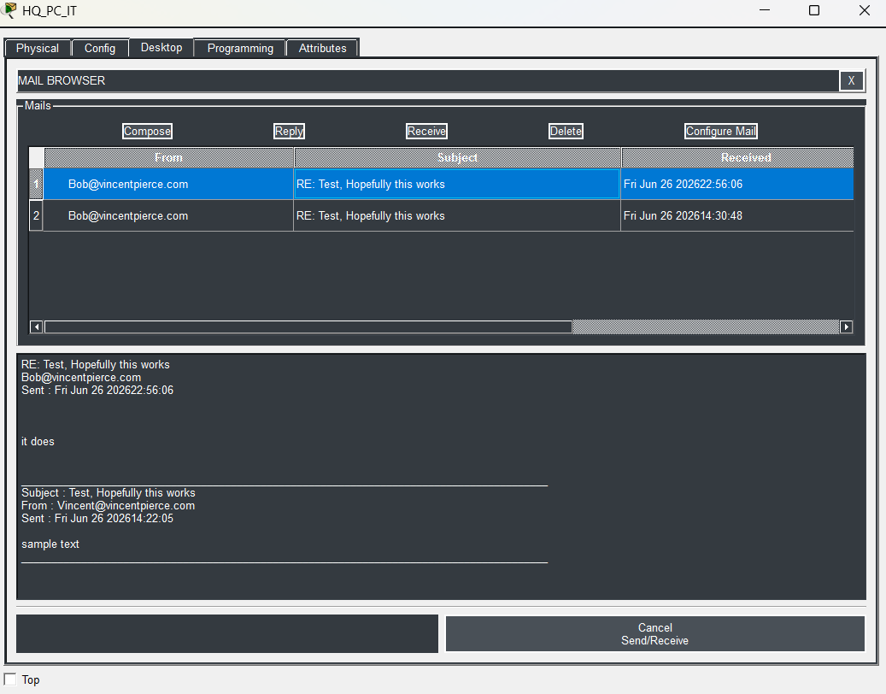
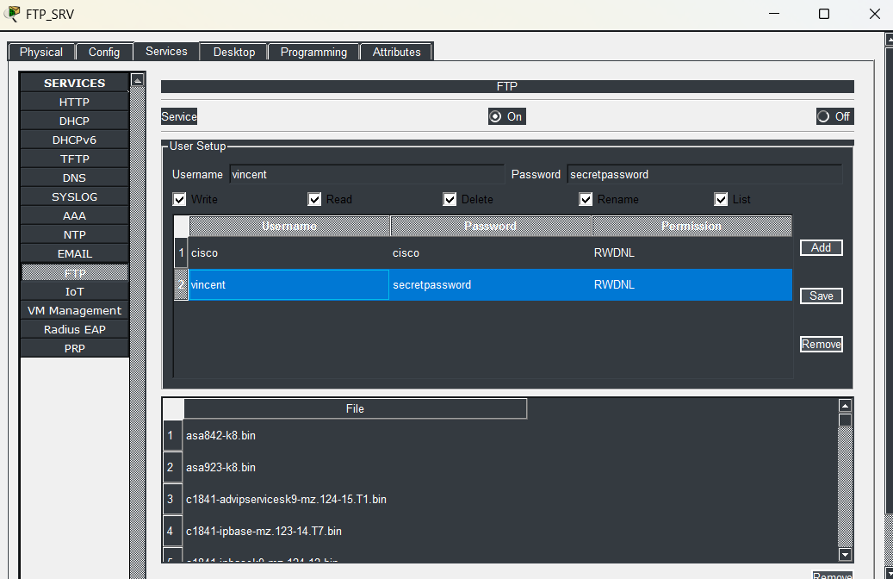

# **Segment 2**

**Author:** Vincent Pierce  
**Project Start Date:** 7/16/2026  
**Latest Revision:** 8/4/2026  

[**Back To Overview**](Overview.md)

This segment represents the switch dedicated to the IT department located in the main headquarters. It contains all the IT infrastructure and devices.
!\[Segment 2 Topology](Images/Segment2-S\_HQ\_IT.png)

## **Devices**

Switches - 1  
PCs - 1  
Phones - 1  
Printers - 1  
APs - 2  
Servers - 6  

### Device Details

IPV4 address will differ from documentation due to DHCP. Not documenting the current state of the address as of the revision date.

**HQ\_Printer (Printer):**

* MAC Address: 0000.0C35.53E2
* Switch Port: 0

**HQ\_AP\_MainHall1 (AP1):**

* MAC Address: Issues are present with the APs not obtaining IP address or MAC
* Switch Port: Issues are present with the APs not obtaining IP address or MAC

**HQ\_AP\_MainHall2 (AP2):**

* MAC Address: Issues are present with the APs not obtaining IP address or MAC
* Switch Port: Issues are present with the APs not obtaining IP address or MAC

**HQ\_PC\_IT (PC):**

* MAC Address: 000D.BD5C.3102
* Switch Port: Fast Ethernet 0

**HQ\_Phone\_IT (Phone):**

* MAC Address: 0030.A337.14EA
* Switch Port: Fast Ethernet

**DNS\_SRV (DNS):**

* Static Address: 192.168.2.2
* MAC Address: 000A.F3DE.D61E
* Switch Port: Fast Ethernet 0

**DNS\_SRV\_BKUP (BDNS):**

* Static Address: 192.168.2.3
* MAC Address: 0001.6414.6259
* Switch Port: Fast Ethernet 0

**DHCP\_SRV (DHCP):**

* Static Address: 192.168.2.4
* MAC Address: 000C.8568.9A2B
* Switch Port: Fast Ethernet 0

**DHCP\_SRV\_BKUP (BDHCP):**

* Static Address: 192.168.2.5
* MAC Address: 000C.8542.EA30
* Switch Port: Fast Ethernet 0

**FTP\_SRV (FTP):**

* Static Address: 192.168.2.6
* MAC Address: 00D0.D360.3376
* Switch Port: Fast Ethernet 0

**FTP\_SRV\_BKUP (BFTP):**

* Static Address: 192.168.2.7
* MAC Address: 00E0.A389.6374
* Switch Port: Fast Ethernet 0

### Switch Details

All of the access switch ports have spanning-tree port fast enabled as well as the bpdu guard. They are verified to be always connected to an endpoint and not looping.

**Fast Ethernet Port 0/1:**

* Switchport Mode: Trunk
* Allowed Trunks: 100, 150, 200, 300
* Native Vlan: 99

**Fast Ethernet Port 0/2:**

* Switchport Mode: Access
* Assigned Vlan: 200
* Connected Device: PC

**Fast Ethernet Port 0/3:**

* Switchport Mode: Access
* Assigned Vlan: 100
* Connected Device: Printer

**Fast Ethernet Port 0/4:**

* Switchport Mode: Access
* Assigned Vlan: 100
* Connected Device: AP1

**Fast Ethernet Port 0/5:**

* Switchport Mode: Access
* Assigned Vlan: 100
* Connected Device: AP2

**Fast Ethernet Port 0/6:**

* Switchport Mode: Access
* Assigned Vlan: 300
* Connected Device: Phone

**Fast Ethernet Port 0/7:**

* Switchport Mode: Access
* Assigned Vlan: 150
* Connected Device: DNS

**Fast Ethernet Port 0/8:**

* Switchport Mode: Access
* Assigned Vlan: 150
* Connected Device: BDNS

**Fast Ethernet Port 0/9:**

* Switchport Mode: Access
* Assigned Vlan: 150
* Connected Device: DHCP

**Fast Ethernet Port 0/10:**

* Switchport Mode: Access
* Assigned Vlan: 150
* Connected Device: BDHCP

**Fast Ethernet Port 0/11:**

* Switchport Mode: Access
* Assigned Vlan: 150
* Connected Device: FTP

**Fast Ethernet Port 0/12:**

* Switchport Mode: Access
* assigned Vlan: 150
* Connected Device: BFTP

## **Proof of Concepts**

*Despite not having a CM list configured, the phones are all able to be accessed. The IT PC is able to ping Segment 1's Phone 3 perfectly fine.*

*All of the subnet pools listed in the network that the DHCP server hands out. The list shows a scroll bar but the last available row is the default serverPool that cannot be removed. The servers themselves are all statically assigned and do not use DHCP.*

*The DNS server has a valid reachable domain from any of the PCs.*

*The simple mail transfer protocol server is setup and able to send emails across the domain to different accounts on different devices.*

*Here is a test of the email successfully working across the SMTP server. This is between the user Bob on (Segment 1)[Section1.md] and my (IT PC)[Section2.md] on Segment 2.*

*File Transfer Protocol is also setup on the same SMTP server.*

[Return to Top](#top)  
[Back To Overview](Overview.md)  

\*  
\*  
\*  

