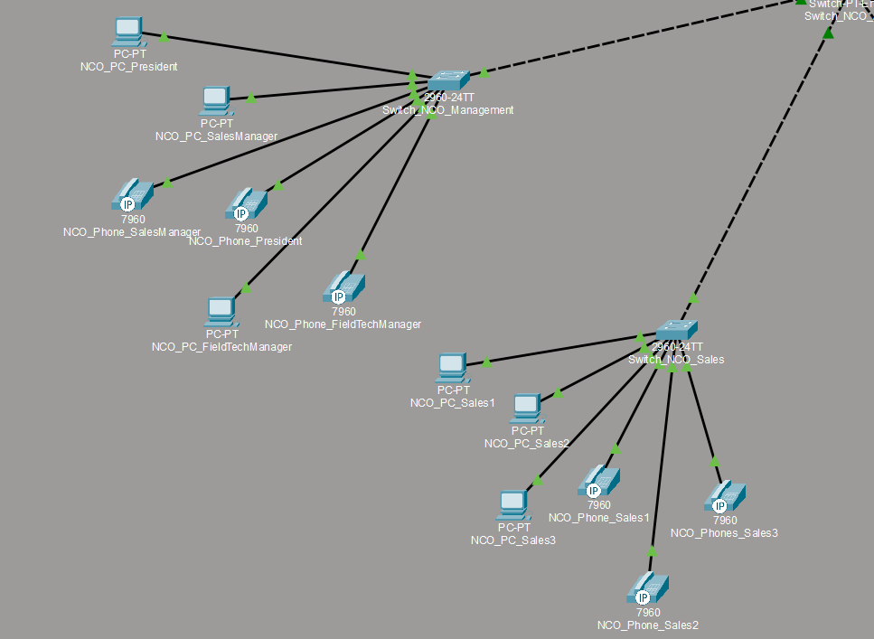
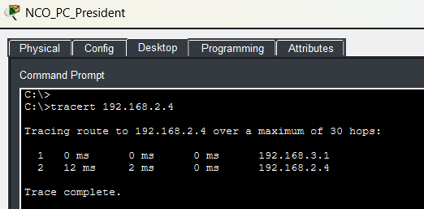
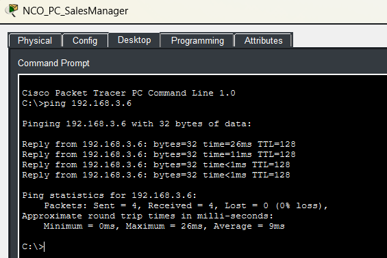
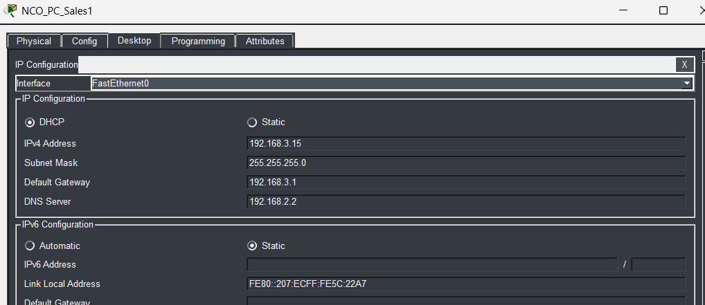

# **Segment 3**

**Author:** Vincent Pierce  
**Project Start Date:** 7/16/2026  
**Latest Revision:** 8/4/2026  

[**Back To Overview**](Overview.md)

This segment of the network contains two switches, one for sales, and one for management. There is not many endpoint devices connected up to either of these, which is why they are combined into a single segment of the network.

## **Devices**

Switches - 2  
PCs - 6  
Phones - 6  

### Device Details

IPV4 address will differ from documentation due to DHCP. Not documenting the current state of the address as of the revision date.

**NCO\_PC\_President (PC1):**

* MAC Address: 0001.C92D.AD30
* Switch Port: Fast Ethernet 0

**NCO\_PC\_SalesManager (PC2):**

* MAC Address: 0001.6496.EE09
* Switch Port: Fast Ethernet 0

**NCO\_PC\_FieldTechManager (PC3):**

* MAC Address: 00E0.B0DB.35EC
* Switch Port: Fast Ethernet 0

**NCO\_PC\_Sales1 (PC4):**

* MAC Address: 0007.EC5C.22A7
* Switch Port: Fast Ethernet 0

**NCO\_PC\_Sales2 (PC5):**

* MAC Address: 0090.2BBE.6B68
* Switch Port: Fast Ethernet 0

**NCO\_PC\_Sales3 (PC6):**

* MAC Address: 0001.C957.3120
* Switch Port: Fast Ethernet 0

**NCO\_Phone\_SalesManager (Phone1):**

* MAC Address: 00E0.B0E5.0E49
* Switch Port: Fast Ethernet

**NCO\_Phone\_President (Phone2):**

* MAC Address: 00D0.580E.348E
* Switch Port: Fast Ethernet

**NCO\_Phone\_FieldTechManager (Phone3):**

* Mac Address: 0001.43A4.A093
* Switch Port: Fast Ethernet

**NCO\_Phone\_Sales1 (Phone 4):**

* MAC Address: 00D0.BCB4.EE86
* Switch Port: Fast Ethernet

**NCO\_Phone\_Sales2 (Phone 5):**

* MAC Address: 000D.BDD2.12C1
* Switch Port: Fast Ethernet

**NCO\_Phones\_Sales3 (Phone 6):**

* MAC Address: 00D0.D389.CE2D
* Switch Port: Fast Ethernet

### Switch Details

All of the access switch ports have spanning-tree port fast enabled as well as the bpdu guard. They are verified to be always connected to an endpoint and not looping.

#### **Switch\_NCO\_Management**

**Fast Ethernet Port 0/1:**

* Switchport Mode: Trunk
* Allowed Trunks: 200, 300
* Native Vlan: 99

**Fast Ethernet Port 0/2:**

* Switchport Mode: Access
* Assigned Vlan: 200
* Connected Device: PC1

**Fast Ethernet Port 0/3:**

* Switchport Mode: Access
* Assigned Vlan: 200
* Connected Device: PC2

**Fast Ethernet Port 0/4:**

* Switchport Mode: Access
* Assigned Vlan: 300
* Connected Device: Phone1

**Fast Ethernet Port 0/5:**

* Switchport Mode: Access
* Assigned Vlan: 300
* Connected Device: Phone2

**Fast Ethernet Port 0/6:**

* Switchport Mode: Access
* Assigned Vlan: 200
* Connected Device: PC3

**Fast Ethernet Port 0/7:**

* Switchport Mode: Access
* Assigned Vlan: 300
* Connected Device: Phone3

#### **Switch\_NCO\_Sales**

**Fast Ethernet Port 0/1:**

* Switchport Mode: Trunk
* Allowed Trunks: 200, 300
* Native Vlan: 99

**Fast Ethernet Port 0/2:**

* Switchport Mode: Access
* Assigned Vlan: 200
* Connected Device: PC4

**Fast Ethernet Port 0/3:**

* Switchport Mode: Access
* Assigned Vlan: 200
* Connected Device: PC5

**Fast Ethernet Port 0/4:**

* Switchport Mode: Access
* Assigned Vlan: 200
* Connected Device: PC6

**Fast Ethernet Port 0/5:**

* Switchport Mode: Access
* Assigned Vlan: 300
* Connected Device: Phone4

**Fast Ethernet Port 0/6:**

* Switchport Mode: Access
* Assigned Vlan: 300
* Connected Device: Phone5

**Fast Ethernet Port 0/7:**

* Switchport Mode: Access
* Assigned Vlan: 300
* Connected Device: Phone6

## **Proof of Concepts**

PC1 indicates the proper hop to reach the DHCP server in vlan 150, which is designated to the servers. 

PC2 has a verified connection that reaches [Segment 5](Section5.md)'s single computer. 

Generic ipconfig info, but decided to utilize packet tracer's GUI in order to demonstrate everything properly updated working as accordingly.

[Return to Top](#top)  
[Back To Overview](Overview.md)

\*  
\*  
\*  

