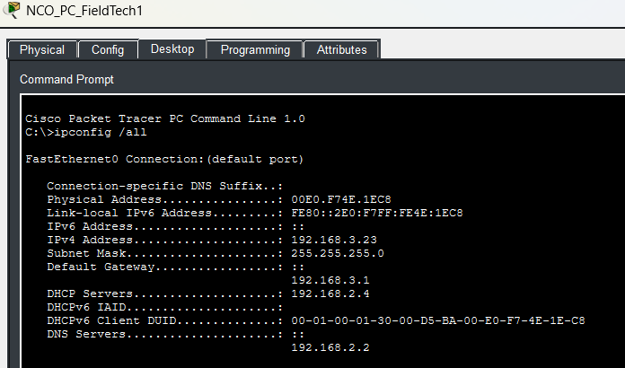
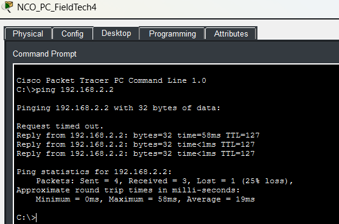
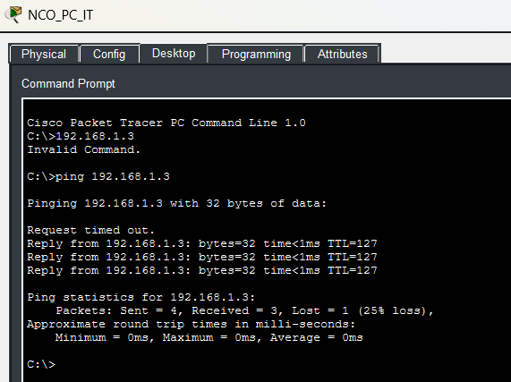

# **Segment 4**

**Author:** Vincent Pierce  
**Project Start Date:** 7/16/2026  
**Latest Revision:** 8/4/2026  

[**Back To Overview**](Overview.md)

This segment represents the switch for the field technicians, the North CO IT equipment, and the North CO Aggregation switch.

## **Devices**

Switches - 2  
PCs - 6  
APs - 2  

### Device Details

IPV4 address will differ from documentation due to DHCP. Not documenting the current state of the address as of the revision date.

**NCO\_PC\_FieldTech1 (PC1):**

* MAC Address: 00E0.F74E.1EC8
* Switch Port: Fast Ethernet 0

**NCO\_PC\_FieldTech2 (PC2):**

* MAC Address: 00D0.BC72.E7AA
* Switch Port: Fast Ethernet 0

**NCO\_PC\_FieldTech3 (PC3):**

* MAC Address: 0090.2B66.19D8
* Switch Port: Fast Ethernet 0

**NCO\_PC\_FieldTech4 (PC4):**

* MAC Address: 00E0.8FEE.35C3
* Switch Port: Fast Ethernet 0

**NCO\_PC\_FieldTech5 (PC5):**

* MAC Address: 0001.638A.7AA8
* Switch Port: Fast Ethernet 0

**NCO\_PC\_IT (PC6):**

* MAC Address: 0001.97A9.A06B
* Switch Port: Fast Ethernet

**NCO\_AP\_MainHall1 (AP1):**

* MAC Address: Issues with the AP obtaining DHCP IP address
* Switch Port: Issues with the AP obtaining DHCP IP address

**NCO\_AP\_MainHall2 (AP2):**

* MAC Address: Issues with the AP obtaining DHCP IP address
* Switch Port: Issues with the AP obtaining DHCP IP address

### Switch Details

All of the access switch ports have spanning-tree port fast enabled as well as the bpdu guard. They are verified to be always connected to an endpoint and not looping.

#### Switch\_NCO\_Techs

**Fast Ethernet Port 0/1:**

* Switchport Mode: Trunk
* Allowed Trunks: 100, 200, 300
* Native Vlan: 99

**Fast Ethernet Port 0/2:**

* Switchport Mode: Access
* Assigned Vlan: 200
* Connected Device: PC1

**Fast Ethernet Port 0/3:**

* Switchport Mode: Access
* Assigned Vlan: 200
* Connected Device: PC2

**Fast Ethernet Port 0/4:**

* Switchport Mode: Access
* Assigned Vlan: 200
* Connected Device: PC3

**Fast Ethernet Port 0/5:**

* Switchport Mode: Access
* Assigned Vlan: 200
* Connected Device: PC4

**Fast Ethernet Port 0/6:**

* Switchport Mode: Access
* Assigned Vlan: 200
* Connected Device: PC5

#### Switch\_NCO\_AGG

**Gigabit Ethernet Port 9/1:**

* Switchport Mode: Trunk
* Allowed Trunks: 100, 200, 300
* Native Vlan: 99

**Fast Ethernet Port 8/1:**

* Switchport Mode: Trunk
* Allowed Trunks: 200, 300
* Native Vlan: 99

**Fast Ethernet Port 7/1:**

* Switchport Mode: Trunk
* Allowed Trunks: 200, 300
* Native Vlan: 99

**Fast Ethernet Port 6/1:**

* Switchport Mode: Trunk
* Allowed Trunks: 200, 300
* Native Vlan: 99

**Fast Ethernet Port 2/1:**

* Switchport Mode: Access
* Assigned Vlan: 200
* Connected Device: PC6

**Gigabit Ethernet Port 1/1:**

* Switchport Mode: Access
* Assigned Vlan: 100
* Connected Device: AP1

**Gigabit Ethernet Port 0/1:**

* Switchport Mode: Access
* Assigned Vlan: 100
* Connected Device: AP2

## **Proof of Concepts**

Demonstrating the ipconfig of PC1 to show default gateway, mac address, and all the details

PC4 successfully pings the DNS server located in [Segment 2](Segment2.md)

Printer cannot physically print anything. So, verifying the ping connects the printer is crucial. The successful pings indicates the printer has an IP address and is connected successfully.

[Return to Top](#top)  

[Back To Overview](Overview.md)  

\*   
\*  
\*   

