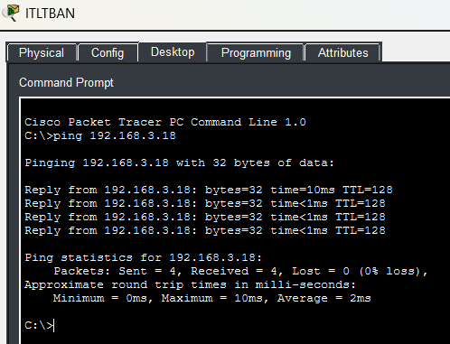

# **Segment 5**

**Author:** Vincent Pierce  
**Project Start Date:** 7/16/2026  
**Latest Revision:** 8/4/2026  

[**Back To Overview**](Overview.md)

This segment represents another office. The laptop was beginning to heavily slow down, and I had to manually configure everything. So, another full network section could not be built. This single PC represents another full office location, and it is setup and working.

## **Devices**

Switches - 1  
PCs - 1  

### Device Details

IPV4 address will differ from documentation due to DHCP. Not documenting the current state of the address as of the revision date.

**ITLTBAN (PC1):**

* MAC Address: 0001.632C.34A0
* Switch Port: Fast Ethernet 0

### Switch Details

All of the access switch ports have spanning-tree port fast enabled as well as the bpdu guard. They are verified to be always connected to an endpoint and not looping.

**Gigabit Ethernet Port 0/1:**

* Switchport Mode: Trunk
* Allowed Trunks: 200
* Native Vlan: 99

**Fast Ethernet Port 0/1:**

* Switchport Mode: Access
* Assigned Vlan: 200
* Connected Device: PC1

## **Proof of Concepts**

  
The single PC at the South CO is connected to the rest of the network successfully.

[Return to Top](#top)  
[Back To Overview](Overview.md)  

\*  
\*  
\*  

