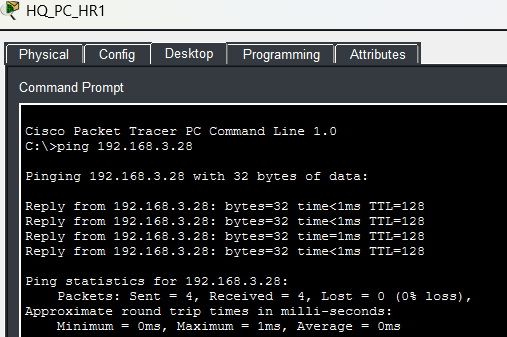
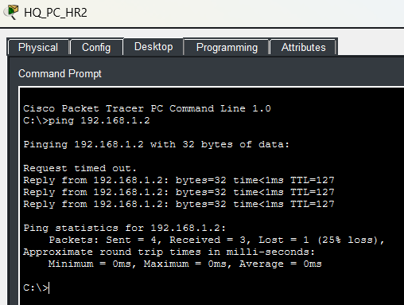
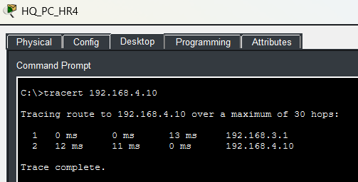

# **Segment 6**

**Author:** Vincent Pierce  
**Project Start Date:** 7/16/2026  
**Latest Revision:** 8/4/2026  

[**Back To Overview**](Overview.md)

Segment six contains the entirety of the HR department and is located in main office headquarters.

## **Devices**

Switches - 1  
PCs - 4  
Phones - 4  

### Device Details

IPV4 address will differ from documentation due to DHCP. Not documenting the current state of the address as of the revision date.

**HQ\_PC\_HR1 (PC1):**

* MAC Address: 0060.2F08.D626
* Switch Port: Fast Ethernet 0

**HQ\_PC\_HR2 (PC2):**

* MAC Address: 000C.CF22.D35A
* Switch Port: Fast Ethernet 0

**HQ\_PC\_HR3 (PC3):**

* MAC Address: 00D0.BC1D.D3C7
* Switch Port: Fast Ethernet 0

**HQ\_PC\_HR4 (PC4):**

* MAC Address: 0090.2174.1D32
* Switch Port: Fast Ethernet 0

**HQ\_Phone\_HR1 (Phone1):**

* MAC Address: 00E0.F73B.D6DA
* Switch Port: Fast Ethernet

**HQ\_Phone\_HR2 (Phone 2):**

* MAC Address: 00E0.F928.6610
* Switch Port: Fast Ethernet

**HQ\_Phone\_HR3 (Phone 3):**

* MAC Address: 0000.0C0C.A4B8
* Switch Port: Fast Ethernet

**HQ\_Phone\_HR4 (Phone 4):**

* MAC Address: 00E0.F9BE.1932
* Switch Port: Fast Ethernet

### Switch Details

All of the access switch ports have spanning-tree port fast enabled as well as the bpdu guard. They are verified to be always connected to an endpoint and not looping.

**Fast Ethernet Port 0/1:**

* Switchport Mode: Trunk
* Allowed Trunks: 200, 300
* Native Vlan: 99

**Fast Ethernet Port 0/2:**

* Switchport Mode: Access
* Assigned Vlan: 200
* Connected Device: PC1

**Fast Ethernet Port 0/3:**

* Switchport Mode: Access
* Assigned Vlan: 200
* Connected Device: PC2

**Fast Ethernet Port 0/4:**

* Switchport Mode: Access
* Assigned Vlan: 200
* Connected Device: PC3

**Fast Ethernet Port 0/5:**

* Switchport Mode: Access
* Assigned Vlan: 200
* Connected Device: PC4

**Fast Ethernet Port 0/6:**

* Switchport Mode: Access
* Assigned Vlan: 200
* Connected Device: Phone1

**Fast Ethernet Port 0/7:**

* Switchport Mode: Access
* Assigned Vlan: 200
* Connected Device: Phone2

**Fast Ethernet Port 0/8:**

* Switchport Mode: Access
* Assigned Vlan: 200
* Connected Device: Phone3

**Fast Ethernet Port 0/9:**

* Switchport Mode: Access
* Assigned Vlan: 200
* Connected Device: Phone4

## **Proof of Concept**

This concept shows devices being able to recognize and ping each other when they are interfaces with the same switch and vlan.

Successful connection to the Printer in (Segment 1)\[Section1.md]. This test is important due to the fact Packet Tracer does not inherently allow you to actually print anything. So, verifying the connection ensures everything is working from a L3 standpoint.

The devices are accurately pathing across the network to route into the appropriate vlans. The example provides a demonstration of the single hop required.

[Return to Top](#top)  
[Back To Overview](Overview.md)  

\*  
\*  
\*  

