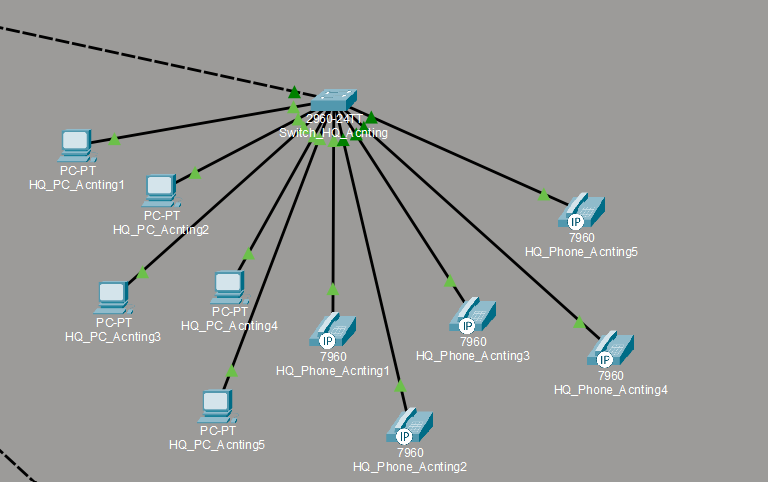
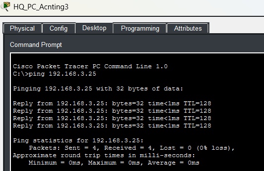
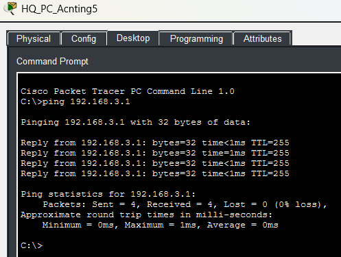

# **Segment 7**

**Author:** Vincent Pierce  
**Project Start Date:** 7/16/2026  
**Latest Revision:** 8/4/2026  

[**Back To Overview**](Overview.md)

Accounting team segment that is located in the main headquarters of the company

## **Devices**

Switches - 1  
PCs - 5  
Phones - 5  

### Device Details

IPV4 address will differ from documentation due to DHCP. Not documenting the current state of the address as of the revision date.

**HQ\_PC\_Acnting1 (PC1):**

* MAC Address: 000B.BE42.BDB0
* Switch Port: Fast Ethernet 0

**HQ\_PC\_Acnting2 (PC2):**

* MAC Address: 0002.4A58.64DA
* Switch Port: Fast Ethernet 0

**HQ\_PC\_Acnting3 (PC3):**

* MAC Address: 0001.4375.D850
* Switch Port: Fast Ethernet 0

**HQ\_PC\_Acnting4 (PC4):**

* MAC Address: 0030.F215.8E7E
* Switch Port: Fast Ethernet 0

**HQ\_PC\_Acnting5 (PC5):**

* MAC Address: 0001.C7E2.A0B7
* Switch Port: Fast Ethernet 0

**HQ\_Phone\_Acnting1 (Phone1):**

* MAC Address: 0009.7C85.B3A4
* Switch Port: Fast Ethernet

**HQ\_Phone\_Acnting2 (Phone2):**

* MAC Address: 0001.96B4.960B
* Switch Port: Fast Ethernet

**HQ\_Phone\_Acnting3 (Phone3):**

* MAC Address: 0001.9734.049E
* Switch Port: Fast Ethernet

**HQ\_Phone\_Acnting4 (Phone4):**

* MAC Address: 0001.9602.6812
* Switch Port: Fast Ethernet

**HQ\_PhoneAcnting5 (Phone5):**

* MAC Address: 0060.3E5A.1E4C
* Switch Port: Fast Ethernet

### Switch Details

All of the access switch ports have spanning-tree port fast enabled as well as the bpdu guard. They are verified to be always connected to an endpoint and not looping.

**Fast Ethernet Port 0/1:**

* Switchport Mode: Trunk
* Allowed Trunks: 200, 300
* Native Vlan: 99

**Fast Ethernet Port 0/2:**

* Switchport Mode: Access
* Assigned Vlan: 200
* Connected Device: PC1

**Fast Ethernet Port 0/3:**

* Switchport Mode: Access
* Assigned Vlan: 200
* Connected Device: PC2

**Fast Ethernet Port 0/4:**

* Switchport Mode: Access
* Assigned Vlan: 200
* Connected Device: PC3

**Fast Ethernet Port 0/5:**

* Switchport Mode: Access
* Assigned Vlan: 200
* Connected Device: PC4

**Fast Ethernet Port 0/6:**

* Switchport Mode: Access
* Assigned Vlan: 200
* Connected Device: PC5

**Fast Ethernet Port 0/7:**

* Switchport Mode: Access
* Assigned Vlan: 300
* Connected Device: Phone1

**Fast Ethernet Port 0/8:**

* Switchport Mode: Access
* Assigned Vlan: 300
* Connected Device: Phone2

**Fast Ethernet Port 0/9:**

* Switchport Mode: Access
* Assigned Vlan: 300
* Connected Device: Phone3

**Fast Ethernet Port 0/10:**

* Switchport Mode: Access
* Assigned Vlan: 300
* Connected Device: Phone4

**Fast Ethernet Port 0/11:**

* Switchport Mode: Access
* Assigned Vlan: 300
* Connected Device: Phone5

## **Proof of Concepts**

  

Ping results of PC3 pinging [Segment 2](Section2.md)'s only PC. The ping remains on the same subnet, but demonstrates successful acknowledgment of PC3 on the network.

  

The result of PC5 pinging the default gateway of the subnet, verifying DHCP, and successful connection to the network.

[Return to Top](#top)  
[Back To Overview](Overview.md)  

\*  
\*  
\*  

